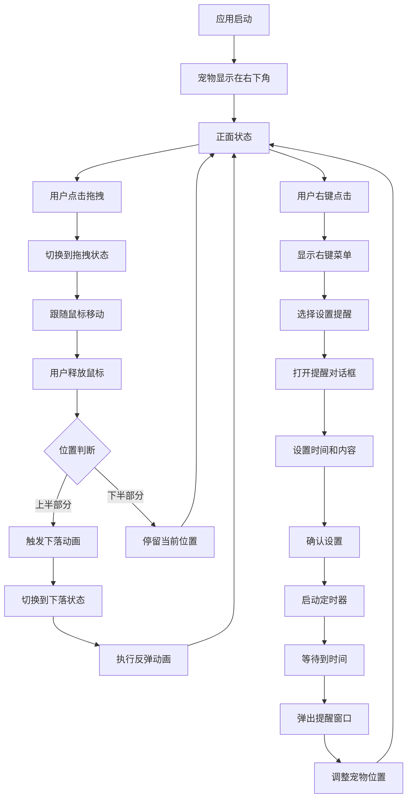

# 桌面宠物产品需求文档

## 1. 产品概述

桌面宠物是一个基于Python + PyQt5开发的桌面陪伴应用，为用户提供可爱的虚拟宠物陪伴体验。

* 主要目的：在用户桌面上显示一个可交互的虚拟宠物，通过拖拽、动画等功能增加工作和学习的趣味性，缓解用户的工作压力。

* 目标用户：需要桌面陪伴、喜欢可爱宠物的电脑用户，特别是长时间使用电脑工作或学习的人群。

* 产品价值：提供轻松愉快的桌面体验，增加用户与电脑交互的趣味性，打造个性化的桌面环境。

## 2. 核心功能

### 2.1 用户角色

本产品为单用户桌面应用，无需用户注册或登录，直接运行即可使用。

### 2.2 功能模块

桌面宠物包含以下核心页面：

### 1.0版本
1. **主界面**：宠物显示区域、状态切换、拖拽交互区域

### 2.0版本
2. **提醒对话框**：时间选择、提醒内容输入、确认取消按钮
3. **右键菜单**：设置提醒选项、退出选项

### 2.3 页面详情

| 页面名称 | 模块名称   | 功能描述                                     |
| ---- | ------ | ---------------------------------------- |
| 主界面  | 宠物图像显示 | 加载并显示宠物的三种状态图像（正面、拖拽、下落），支持动态调整图像大小并保持比例 |
| 主界面  | 拖拽交互   | 通过鼠标事件实现宠物拖拽功能，包含平滑动画效果和状态切换             |
| 主界面  | 下落动画   | 当宠物被拖拽到屏幕上半部分时触发下落动画，包含反弹效果              |
| 主界面  | 窗口管理   | 无边框透明窗口，置顶显示，初始位置在屏幕右下角                  |
| 主界面  | 右键菜单   | 右键点击宠物显示菜单，包含"设置提醒"和"退出"选项               |
| 提醒对话框 | 时间选择   | 使用QTimeEdit让用户选择提醒时间，支持小时和分钟设置              |
| 提醒对话框 | 内容输入   | 使用QLineEdit让用户输入提醒内容，支持自定义提醒文本              |
| 提醒对话框 | 按钮控制   | 确认和取消按钮，确认后设置定时器，取消后关闭对话框                |
| 主界面  | 定时提醒   | 使用QTimer实现定时功能，到时间后弹出QMessageBox提醒窗口          |

## 3. 核心流程

### 3.1 基础交互流程（1.0版本）

1. 启动应用后，宠物出现在屏幕右下角，显示正面状态
2. 用户点击宠物开始拖拽，宠物切换到拖拽状态
3. 用户拖拽宠物到任意位置，宠物跟随鼠标移动
4. 用户释放鼠标，如果宠物在屏幕上半部分则触发下落动画，否则停留在当前位置
5. 下落动画完成后，宠物回到正面状态

### 3.2 定时提醒流程（2.0版本）

1. 用户右键点击宠物，弹出右键菜单
2. 用户选择"设置提醒"选项，打开提醒对话框
3. 用户在对话框中选择提醒时间（QTimeEdit）和输入提醒内容（QLineEdit）
4. 用户点击确认按钮，系统计算时间差并启动QTimer定时器
5. 到达设定时间时，QTimer触发timeout信号
6. 系统弹出QMessageBox提醒窗口，显示用户设置的提醒内容
7. 宠物位置调整到提醒窗口上方，增强视觉效果

## 4. 用户界面设计

### 4.1 设计风格

* **主色调**：透明背景，宠物图像采用可爱卡通风格

* **窗口样式**：无边框、透明背景、置顶显示

* **动画效果**：平滑的拖拽动画和自然的下落反弹效果

* **图标风格**：可爱的宠物形象，支持多种状态表情

* **交互反馈**：鼠标悬停和拖拽时的视觉反馈

### 4.2 页面设计概览

| 页面名称 | 模块名称   | UI元素                               |
| ---- | ------ | ---------------------------------- |
| 主界面  | 宠物显示区域 | 透明背景窗口，宠物图像居中显示，支持三种状态切换（正面/拖拽/下落） |
| 主界面  | 拖拽交互   | 鼠标指针变化，拖拽时宠物跟随移动，平滑动画过渡            |
| 主界面  | 下落动画   | 重力下落效果，底部反弹动画，状态图像同步切换             |

### 4.3 响应性设计

* **桌面适配**：支持不同分辨率的桌面环境

* **图像缩放**：根据窗口大小自动调整宠物图像尺寸，保持比例

* **位置适应**：确保宠物始终在可见区域内，避免超出屏幕边界

