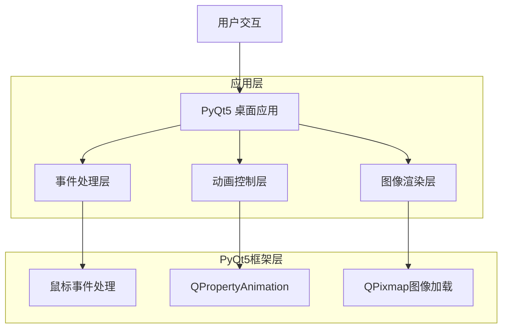
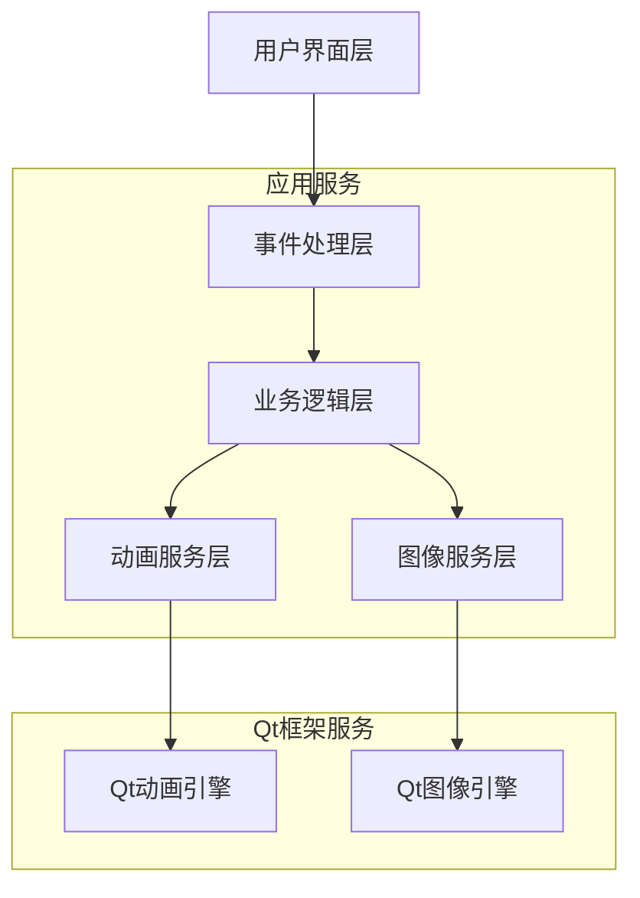
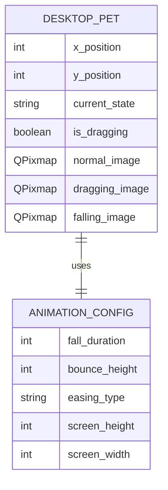

# 桌面宠物技术架构文档

## 1. 架构设计



## 2. 技术描述

* **前端界面**：PyQt5 + Python 3.7+

* **图像处理**：QPixmap + QLabel

* **动画系统**：QPropertyAnimation + QEasingCurve

* **事件处理**：Qt事件系统（mousePressEvent, mouseMoveEvent, mouseReleaseEvent）

* **定时器**：QTimer

## 3. 路由定义

| 功能模块 | 对应类/方法                                           | 用途                  |
| ---- | ------------------------------------------------ | ------------------- |
| 主窗口  | DesktopPet类                                      | 桌面宠物主窗口，继承QWidget   |
| 图像显示 | QLabel组件                                         | 显示宠物图像，支持透明背景       |
| 拖拽处理 | mousePressEvent/mouseMoveEvent/mouseReleaseEvent | 处理鼠标拖拽交互            |
| 动画控制 | QPropertyAnimation                               | 控制下落和反弹动画效果         |
| 状态管理 | PetState枚举                                       | 管理宠物的三种状态（正面/拖拽/下落） |
| 右键菜单 | contextMenuEvent/QMenu                           | 处理右键菜单显示和选项处理       |
| 提醒对话框 | ReminderDialog类                                  | 提醒设置对话框，继承QDialog    |
| 定时提醒 | QTimer                                           | 实现定时提醒功能            |
| 提醒窗口 | QMessageBox                                      | 显示提醒内容              |

## 4. API定义

### 4.1 核心类设计

**DesktopPet类**

```python
class DesktopPet(QWidget):
    def __init__(self):
        # 初始化窗口属性
        pass
    
    def load_images(self):
        # 加载三种状态的宠物图像
        pass
    
    def mousePressEvent(self, event):
        # 处理鼠标按下事件
        pass
    
    def mouseMoveEvent(self, event):
        # 处理鼠标移动事件
        pass
    
    def mouseReleaseEvent(self, event):
        # 处理鼠标释放事件
        pass
    
    def start_fall_animation(self):
        # 开始下落动画
        pass
    
    def change_pet_state(self, state):
        # 切换宠物状态
        pass
    
    def contextMenuEvent(self, event):
        # 处理右键菜单事件
        pass
    
    def show_reminder_dialog(self):
        # 显示提醒设置对话框
        pass
    
    def set_reminder(self, reminder_time, content):
        # 设置定时提醒
        pass
    
    def show_reminder_message(self, content):
        # 显示提醒消息
        pass
    
    def adjust_position_for_reminder(self):
        # 调整宠物位置以配合提醒窗口显示
        pass
```

**PetState枚举**

```python
from enum import Enum

class PetState(Enum):
    NORMAL = "normal"      # 正面状态
    DRAGGING = "dragging"  # 拖拽状态
    FALLING = "falling"    # 下落状态
```

**ReminderDialog类**

```python
class ReminderDialog(QDialog):
    def __init__(self, parent=None):
        # 初始化对话框
        pass
    
    def setup_ui(self):
        # 设置界面布局
        pass
    
    def get_reminder_time(self):
        # 获取用户设置的提醒时间
        pass
    
    def get_reminder_content(self):
        # 获取用户输入的提醒内容
        pass
    
    def accept(self):
        # 确认按钮处理
        pass
```

### 4.2 关键方法参数

**窗口初始化参数**

| 参数名称              | 参数类型           | 是否必需 | 描述            |
| ----------------- | -------------- | ---- | ------------- |
| window\_flags     | Qt.WindowFlags | 是    | 设置无边框、置顶等窗口属性 |
| background        | Qt.transparent | 是    | 设置透明背景        |
| initial\_position | QPoint         | 是    | 初始位置（屏幕右下角）   |

**图像加载参数**

| 参数名称                | 参数类型    | 是否必需 | 描述       |
| ------------------- | ------- | ---- | -------- |
| image\_path         | string  | 是    | 图像文件路径   |
| scale\_size         | QSize   | 否    | 缩放后的图像尺寸 |
| keep\_aspect\_ratio | boolean | 是    | 是否保持宽高比  |

**动画参数**

| 参数名称          | 参数类型              | 是否必需 | 描述         |
| ------------- | ----------------- | ---- | ---------- |
| duration      | int               | 是    | 动画持续时间（毫秒） |
| easing\_curve | QEasingCurve.Type | 是    | 缓动曲线类型     |
| start\_value  | QPoint            | 是    | 动画起始位置     |
| end\_value    | QPoint            | 是    | 动画结束位置     |

## 5. 服务架构图



## 6. 数据模型

### 6.1 数据模型定义



### 6.2 配置文件结构

**应用配置**

```python
# config.py
class PetConfig:
    # 窗口配置
    WINDOW_WIDTH = 100
    WINDOW_HEIGHT = 100
    INITIAL_X_OFFSET = 150  # 距离右边缘的距离
    INITIAL_Y_OFFSET = 150  # 距离底边缘的距离
    
    # 图像配置
    IMAGE_PATHS = {
        'normal': 'assets/pet_normal.png',
        'dragging': 'assets/pet_dragging.png',
        'falling': 'assets/pet_falling.png'
    }
    
    # 动画配置
    FALL_DURATION = 1000  # 下落动画时长（毫秒）
    BOUNCE_HEIGHT = 50    # 反弹高度（像素）
    GRAVITY_ACCELERATION = 9.8  # 重力加速度模拟
    
    # 交互配置
    DRAG_THRESHOLD = 5    # 拖拽触发阈值（像素）
    SCREEN_TOP_THRESHOLD = 0.5  # 屏幕上半部分阈值
    
    # 提醒功能配置（2.0版本新增）
    REMINDER_DIALOG_WIDTH = 300   # 提醒对话框宽度
    REMINDER_DIALOG_HEIGHT = 200  # 提醒对话框高度
    REMINDER_MESSAGE_DURATION = 5000  # 提醒消息显示时长（毫秒）
    PET_REMINDER_OFFSET = 50      # 宠物相对提醒窗口的偏移距离
```

**依赖包配置**

```python
# requirements.txt
PyQt5>=5.15.0
Python>=3.7
```

