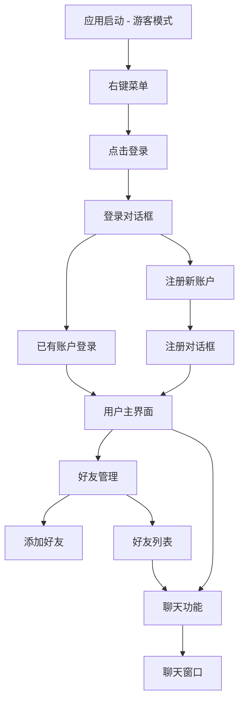

# 桌面宠物用户系统功能需求文档

## 1. 产品概述

为现有桌面宠物应用添加完整的用户系统功能，包括用户登录注册、好友管理和聊天功能，提升用户体验和社交互动性。
- 在保持现有功能完整性的基础上，增加用户身份管理和社交功能
- 通过Supabase云数据库实现用户数据的安全存储和管理
- 为用户提供更丰富的社交体验，增强产品粘性

## 2. 核心功能

### 2.1 用户角色

| 角色 | 注册方式 | 核心权限 |
|------|----------|----------|
| 游客用户 | 默认状态，无需注册 | 可使用所有现有基础功能（宠物互动、提醒等） |
| 注册用户 | 用户名密码注册 | 拥有游客权限 + 好友管理 + 聊天功能 + 个人资料管理 |

### 2.2 功能模块

我们的用户系统需求包含以下主要页面：
1. **登录对话框**：用户身份验证，支持登录和注册切换
2. **注册对话框**：新用户账户创建，密码强度验证
3. **用户信息管理页面**：个人资料查看和编辑
4. **好友管理页面**：好友列表展示，添加好友功能
5. **聊天窗口**：好友间实时聊天界面
6. **好友添加对话框**：通过用户名或ID搜索添加好友

### 2.3 页面详情

| 页面名称 | 模块名称 | 功能描述 |
|----------|----------|----------|
| 登录对话框 | 登录表单 | 输入用户名密码进行身份验证，显示登录状态和错误提示 |
| 登录对话框 | 注册入口 | 提供注册链接，切换到注册界面 |
| 注册对话框 | 注册表单 | 用户名唯一性检查，密码强度验证（5-20位，包含数字字母） |
| 注册对话框 | 验证提示 | 实时显示用户名可用性和密码强度提示 |
| 用户信息管理页面 | 个人资料 | 显示用户名、注册时间等基本信息 |
| 用户信息管理页面 | 账户操作 | 提供登出功能，返回游客模式 |
| 好友管理页面 | 好友列表 | 展示已添加好友，显示在线状态和最后活动时间 |
| 好友管理页面 | 添加好友 | 通过用户名或ID搜索并发送好友请求 |
| 好友管理页面 | 好友请求 | 显示收到的好友请求，支持接受或拒绝 |
| 聊天窗口 | 消息列表 | 显示与选定好友的聊天记录，按时间排序 |
| 聊天窗口 | 消息输入 | 文本输入框和发送按钮，支持回车发送 |
| 聊天窗口 | 新消息提示 | 未读消息数量显示，新消息到达提醒 |
| 好友添加对话框 | 搜索功能 | 输入用户名或ID进行用户搜索 |
| 好友添加对话框 | 请求发送 | 发送好友请求，显示发送状态和结果提示 |

## 3. 核心流程

### 游客用户流程
用户启动应用后默认为游客模式，可正常使用所有现有功能。通过右键菜单中的"登录"选项可进入登录界面。

### 注册用户流程
用户点击登录界面的"注册"链接进入注册页面，输入用户名和密码完成注册。注册成功后自动登录并获得完整功能权限。

### 好友管理流程
登录用户可通过好友管理页面添加好友，搜索其他用户并发送好友请求。被添加用户收到请求后可选择接受或拒绝。

### 聊天功能流程
好友之间可通过聊天窗口发送消息，消息实时显示并保存到本地数据库。新消息会有明显的提示标识。

## 4. 用户界面设计

### 4.1 设计风格

- **主色调**：保持与现有桌面宠物一致的温馨色彩，主色#4CAF50，辅助色#FFC107
- **按钮样式**：圆角矩形按钮，悬停时有轻微阴影效果
- **字体**：系统默认字体，标题14px，正文12px，提示文字10px
- **布局风格**：简洁的对话框设计，卡片式好友列表，聊天气泡样式消息
- **图标风格**：使用简洁的线性图标，好友头像采用圆形设计

### 4.2 页面设计概览

| 页面名称 | 模块名称 | UI元素 |
|----------|----------|--------|
| 登录对话框 | 登录表单 | 居中布局，用户名密码输入框，登录按钮，"记住我"复选框 |
| 登录对话框 | 注册入口 | 底部链接文字，点击切换到注册界面 |
| 注册对话框 | 注册表单 | 用户名输入框带实时验证提示，密码强度指示器，确认密码输入框 |
| 好友管理页面 | 好友列表 | 垂直卡片列表，每个好友显示头像、用户名、在线状态 |
| 好友管理页面 | 添加按钮 | 右上角"+"按钮，点击弹出添加好友对话框 |
| 聊天窗口 | 消息区域 | 滚动列表，发送消息右对齐绿色气泡，接收消息左对齐白色气泡 |
| 聊天窗口 | 输入区域 | 底部固定，文本输入框占主要空间，右侧发送按钮 |

### 4.3 响应式设计

界面采用固定尺寸对话框设计，适配桌面环境使用。所有对话框支持键盘操作，提升用户体验。