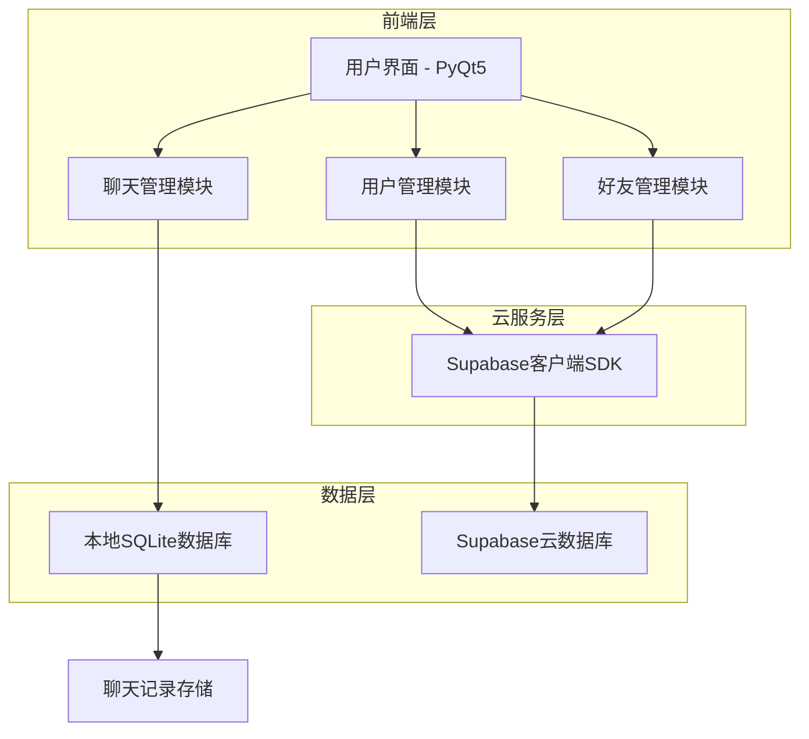
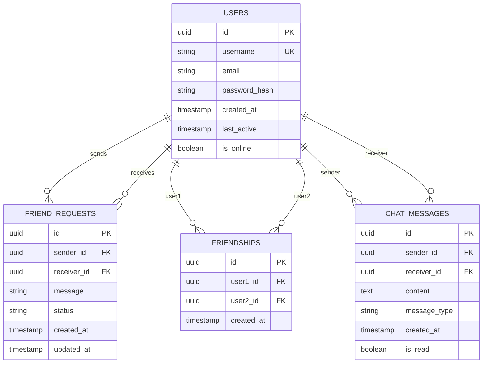

# 桌面宠物用户系统技术架构文档

## 1. 架构设计



## 2. 技术描述

- **前端**: PyQt5 + 现有桌面宠物框架
- **云数据库**: Supabase (PostgreSQL)
- **本地数据库**: SQLite (聊天记录存储)
- **身份验证**: Supabase Auth
- **实时通信**: Supabase Realtime (WebSocket)

## 3. 路由定义

| 路由 | 用途 |
|------|------|
| /login | 登录对话框，处理用户身份验证 |
| /register | 注册对话框，创建新用户账户 |
| /profile | 用户信息管理页面，显示和编辑个人资料 |
| /friends | 好友管理页面，好友列表和添加功能 |
| /chat/{friend_id} | 聊天窗口，与指定好友的聊天界面 |
| /add_friend | 添加好友对话框，搜索和发送好友请求 |

## 4. API定义

### 4.1 用户认证相关

**用户注册**
```
POST /auth/signup (Supabase)
```

请求参数:
| 参数名 | 参数类型 | 是否必需 | 描述 |
|--------|----------|----------|------|
| username | string | true | 用户名，3-20位字符 |
| password | string | true | 密码，5-20位包含数字字母 |
| email | string | true | 邮箱地址（可选，用于找回密码） |

响应参数:
| 参数名 | 参数类型 | 描述 |
|--------|----------|------|
| success | boolean | 注册是否成功 |
| user_id | string | 用户唯一标识 |
| message | string | 响应消息 |

**用户登录**
```
POST /auth/signin (Supabase)
```

请求参数:
| 参数名 | 参数类型 | 是否必需 | 描述 |
|--------|----------|----------|------|
| username | string | true | 用户名 |
| password | string | true | 密码 |

响应参数:
| 参数名 | 参数类型 | 描述 |
|--------|----------|------|
| success | boolean | 登录是否成功 |
| access_token | string | 访问令牌 |
| user_info | object | 用户基本信息 |

### 4.2 好友管理相关

**搜索用户**
```
GET /api/users/search
```

请求参数:
| 参数名 | 参数类型 | 是否必需 | 描述 |
|--------|----------|----------|------|
| query | string | true | 搜索关键词（用户名或ID） |

响应参数:
| 参数名 | 参数类型 | 描述 |
|--------|----------|------|
| users | array | 匹配的用户列表 |
| total | number | 搜索结果总数 |

**发送好友请求**
```
POST /api/friends/request
```

请求参数:
| 参数名 | 参数类型 | 是否必需 | 描述 |
|--------|----------|----------|------|
| target_user_id | string | true | 目标用户ID |
| message | string | false | 请求消息 |

### 4.3 聊天功能相关

**获取聊天记录**
```
GET /api/chat/history
```

请求参数:
| 参数名 | 参数类型 | 是否必需 | 描述 |
|--------|----------|----------|------|
| friend_id | string | true | 好友用户ID |
| limit | number | false | 消息数量限制，默认50 |
| offset | number | false | 分页偏移量 |

**发送消息**
```
POST /api/chat/send
```

请求参数:
| 参数名 | 参数类型 | 是否必需 | 描述 |
|--------|----------|----------|------|
| receiver_id | string | true | 接收者用户ID |
| content | string | true | 消息内容 |
| message_type | string | false | 消息类型，默认text |

## 5. 数据模型

### 5.1 数据模型定义



### 5.2 数据定义语言

**用户表 (users)**
```sql
-- 创建用户表
CREATE TABLE users (
    id UUID PRIMARY KEY DEFAULT gen_random_uuid(),
    username VARCHAR(50) UNIQUE NOT NULL,
    email VARCHAR(255) UNIQUE,
    password_hash VARCHAR(255) NOT NULL,
    created_at TIMESTAMP WITH TIME ZONE DEFAULT NOW(),
    last_active TIMESTAMP WITH TIME ZONE DEFAULT NOW(),
    is_online BOOLEAN DEFAULT false
);

-- 创建索引
CREATE INDEX idx_users_username ON users(username);
CREATE INDEX idx_users_email ON users(email);
CREATE INDEX idx_users_last_active ON users(last_active DESC);

-- 设置权限
GRANT SELECT ON users TO anon;
GRANT ALL PRIVILEGES ON users TO authenticated;
```

**好友请求表 (friend_requests)**
```sql
-- 创建好友请求表
CREATE TABLE friend_requests (
    id UUID PRIMARY KEY DEFAULT gen_random_uuid(),
    sender_id UUID NOT NULL REFERENCES users(id) ON DELETE CASCADE,
    receiver_id UUID NOT NULL REFERENCES users(id) ON DELETE CASCADE,
    message TEXT,
    status VARCHAR(20) DEFAULT 'pending' CHECK (status IN ('pending', 'accepted', 'rejected')),
    created_at TIMESTAMP WITH TIME ZONE DEFAULT NOW(),
    updated_at TIMESTAMP WITH TIME ZONE DEFAULT NOW()
);

-- 创建索引
CREATE INDEX idx_friend_requests_receiver ON friend_requests(receiver_id, status);
CREATE INDEX idx_friend_requests_sender ON friend_requests(sender_id);

-- 防止重复请求的唯一约束
CREATE UNIQUE INDEX idx_friend_requests_unique ON friend_requests(sender_id, receiver_id) WHERE status = 'pending';

-- 设置权限
GRANT SELECT ON friend_requests TO anon;
GRANT ALL PRIVILEGES ON friend_requests TO authenticated;
```

**好友关系表 (friendships)**
```sql
-- 创建好友关系表
CREATE TABLE friendships (
    id UUID PRIMARY KEY DEFAULT gen_random_uuid(),
    user1_id UUID NOT NULL REFERENCES users(id) ON DELETE CASCADE,
    user2_id UUID NOT NULL REFERENCES users(id) ON DELETE CASCADE,
    created_at TIMESTAMP WITH TIME ZONE DEFAULT NOW(),
    CONSTRAINT friendship_users_different CHECK (user1_id != user2_id)
);

-- 创建索引
CREATE INDEX idx_friendships_user1 ON friendships(user1_id);
CREATE INDEX idx_friendships_user2 ON friendships(user2_id);

-- 防止重复好友关系的唯一约束
CREATE UNIQUE INDEX idx_friendships_unique ON friendships(LEAST(user1_id, user2_id), GREATEST(user1_id, user2_id));

-- 设置权限
GRANT SELECT ON friendships TO anon;
GRANT ALL PRIVILEGES ON friendships TO authenticated;
```

**聊天消息表 (chat_messages) - 本地SQLite**
```sql
-- 本地SQLite数据库中的聊天消息表
CREATE TABLE chat_messages (
    id INTEGER PRIMARY KEY AUTOINCREMENT,
    sender_id TEXT NOT NULL,
    receiver_id TEXT NOT NULL,
    content TEXT NOT NULL,
    message_type TEXT DEFAULT 'text',
    created_at TIMESTAMP DEFAULT CURRENT_TIMESTAMP,
    is_read BOOLEAN DEFAULT 0,
    sync_status TEXT DEFAULT 'local' -- local, synced, failed
);

-- 创建索引
CREATE INDEX idx_chat_messages_conversation ON chat_messages(sender_id, receiver_id, created_at);
CREATE INDEX idx_chat_messages_unread ON chat_messages(receiver_id, is_read);
CREATE INDEX idx_chat_messages_sync ON chat_messages(sync_status);
```

**初始化数据**
```sql
-- 插入测试用户数据
INSERT INTO users (username, email, password_hash) VALUES 
('demo_user', 'demo@example.com', '$2b$12$example_hash'),
('test_user', 'test@example.com', '$2b$12$example_hash2');
```